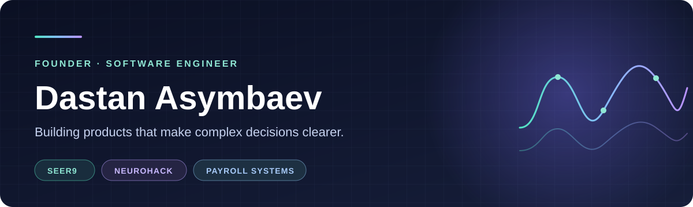

  

  George Bellows, <a href="https://www.nga.gov/artworks/46557-blue-morning"><em>Blue Morning</em></a> (1909) · National Gallery of Art · public domain

I build software and products. Right now I'm working on Seer9. Before that, I shipped NeuroHack on iOS. I've also worked on payroll integrations.

## Projects

### Seer9

[Seer9](https://seer9.com) puts sports forecasts, market prices, and live context side by side. I publish the [methodology](https://seer9.com/methodology) and [settled results](https://seer9.com/proof) so people can check the models for themselves.

The [public proof-chain repository](https://github.com/asymbaev/seer9-proofs) documents the verification workflow.

### NeuroHack

[NeuroHack](https://apps.apple.com/us/app/neurohack/id6754859121) is an iPhone and iPad app I built and released. It offers short, voice-guided exercises for patterns such as overthinking and procrastination.

## Other work

I've worked on payroll integrations and the backend flows that move data between business systems. Getting those details right matters when people's pay is involved.

## Public code

- [seer9-proofs](https://github.com/asymbaev/seer9-proofs) — Seer9 proof-chain design and publishing workflow.
- [BrainTwin](https://github.com/asymbaev/BrainTwin) / [BrainTwin-backend](https://github.com/asymbaev/BrainTwin-backend) — SwiftUI app and Supabase backend from an earlier product exploration.
